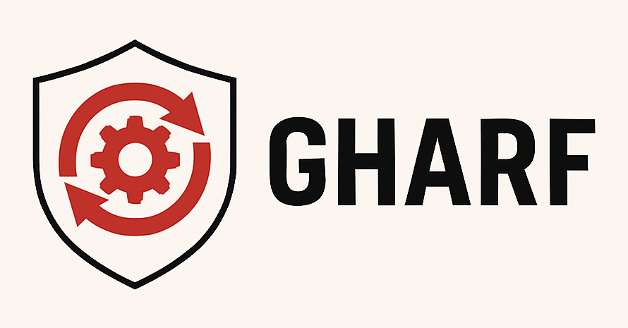
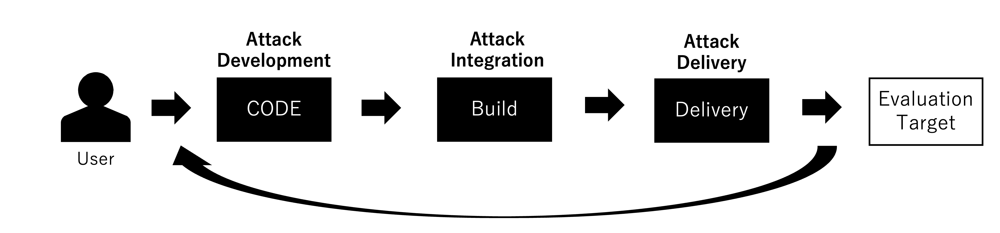
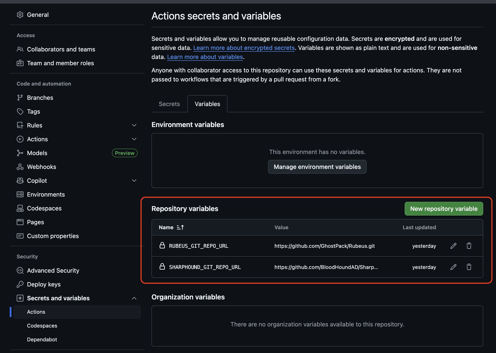
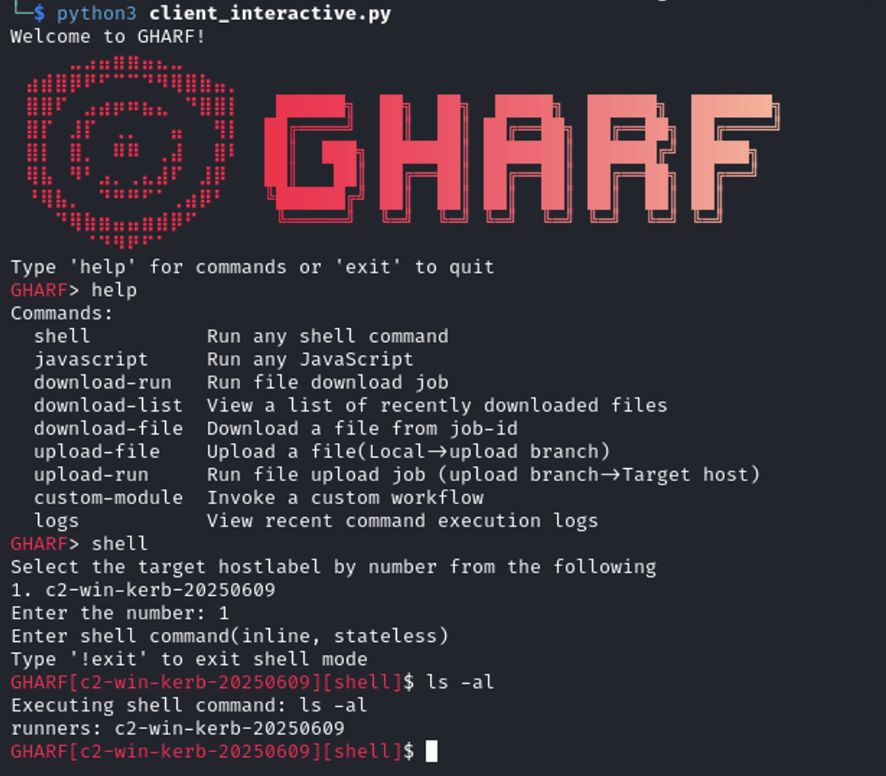
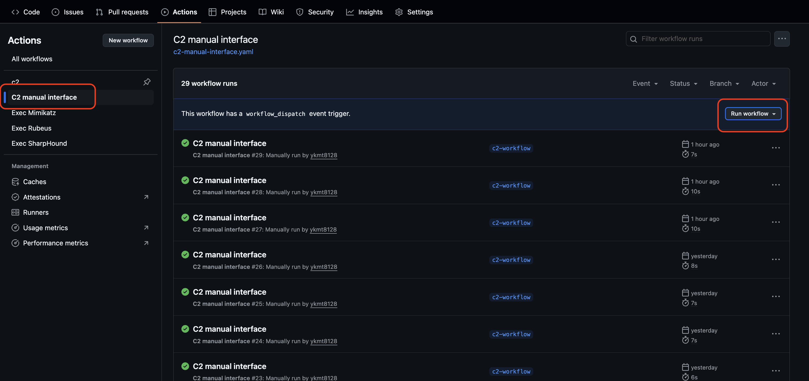
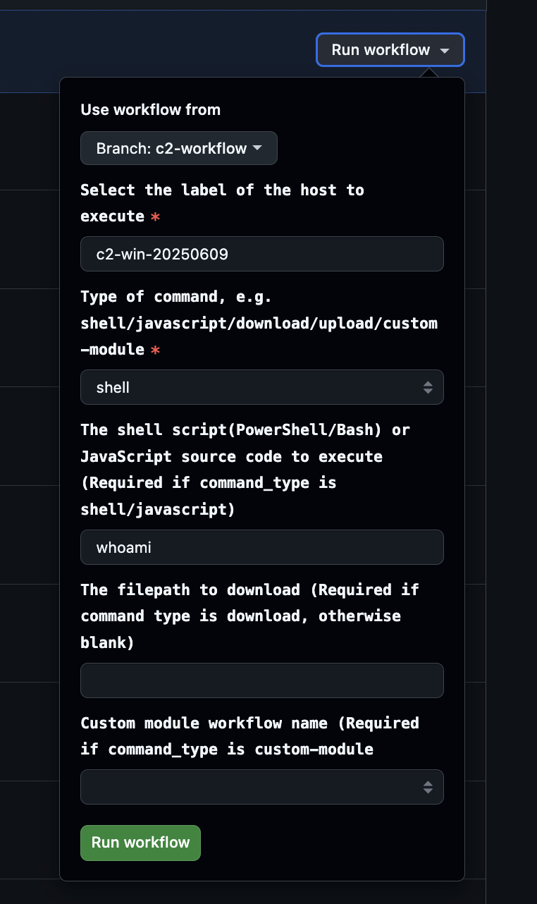

# GHARF: GitHub Actions RedTeam Framework



## Overview
GHARF is an efficient support framework for Red Team exercises that applies the concept of CI/CD (Continuous Integration / Continuous Delivery). It can be used for exercises aimed at security assessment, research, and human resource development.

This tool automates various phases of Red Team operations from the development and preparation of simulated attacks to their execution by applying the build and delivery mechanisms of CI/CD. As a result, Red Team operations become significantly more efficient, enabling rapid iteration of operational cycles. We refer to this concept as “Continuous Attack Integration / Continuous Attack Delivery (CAI/CAD).”



### Features
**Continuous Attack Integration / Continuous Attack Delivery**

* Fully Automated Red Team Operations
  * Automates the entire process of Red Team operations from attack development to preparation and execution
  * Allows Red Team to focus on scenario development rather than operational overhead
  * Connects each operation as a pipeline, enabling seamless handoff of obtained capabilities between phases
    * For example: an attack tool can be built, automatically executed in the target environment, and then analyzed, with results output all without manual intervention

* Red Team Operations as Code
  * Operations can be structurally defined as workflow files
  * Workflow files serve as documentation for the operation itself
  * Enables repeatable execution of operations
  * Supports version control of operational logic
  * Makes operations portable and transferable across environments

* Resource-Less
  * Uses the Runner Application as a C2 agent eliminating the need to develop one from scratch
  * Leverages GitHub repositories as C2 servers no need to build a separate C2 infrastructure
  * Enables attack tool building using GitHub-hosted runners no dedicated build environment required
  * Supports result analysis and processing (e.g., password cracking) using GitHub-hosted runners again, no separate environment needed

* Easy and Fast Setup
  * Quick and simple process to get started with the minimum requirements:
    * Create a GitHub account
    * Set up a GitHub repository for attack development
    * Run the Runner Application in the target environment

### LICENSE
GHARF is released under Apache License Version 2.0. For more details, please refer to the [LICENSE](./LICENSE) file.

> [!IMPORTANT]
> This framework is designed and developed to streamline each phase of Red Team operations by applying CI/CD principles, thereby enabling more efficient execution of security exercises. As stated in the Apache License 2.0, the developers and contributors bear no responsibility for any damages arising from the use of this tool.


## Framework
This framework automates Red Team operations using GitHub Actions. The overall structure is outlined below.

### Components
The framework provides the following core components, both of which are publicly provided and maintained by our team:

* **CLI Client** ([gharf](https://github.com/nttcom/gharf)):  
A command-line interface developed and maintained by our team for triggering and controlling Red Team operations with GHARF. It allows users to execute workflow files, retrieve results, and interactively run commands.

* **GHARF Starter Repository** ([gharf-workflows](https://github.com/nttcom/gharf-workflows)):  
A publicly available starter repository provided by our team. It includes a minimal working implementation consisting of essential code and configuration files required to begin using GHARF. Users are expected to clone and extend this repository to create their own AttackDevOps Repository, which serves as the main codebase for designing, implementing, and managing Red Team operations.

In addition, the framework utilizes GitHub Actions as its CI/CD platform. The following elements play key roles:
* **Code Repository (AttackDevOps Repository)**:  
The user’s working repository, based on the GHARF Starter Repository. It hosts the operation definitions, workflow files, and code used to design, implement, and manage Red Team operations.

* **GitHub-Hosted Runner**:  
A virtual machine provided by GitHub to execute workflows. Used to build attack tools and analyze execution results.

* **Self-Hosted Runner**:  
A feature that allows users to add their own runners as workflow execution environments. This is used to deliver attacks.

* **Runner Application**:  
The official agent provided by GitHub for running self-hosted runners. It is deployed in the target evaluation environment.

* **GitHub Actions Web-UI**:  
GitHub provides a web interface for viewing and triggering workflows. This framework is designed to support manual operation through that interface, enabling users to run Red Team operations without using the CLI client.

Users build and execute operations using this framework by leveraging the capabilities of GitHub Actions.

```
  Setup Self-Hosted Runner    ┌────────────────┐                            
          ┌───────────────────┤    Red Team    │                            
          │                   └────┬─────────┬─┘                            
          │                        │         │                              
┌─────────┼──────────┐             │    ┌────┴─────┐                        
│ Target  ▼          │             ▼    │CLI Client│                        
│┌──────────────────┐│       ┌────────┐ └────┬─────┘                        
││Runner Application││       │Manual  │      │                              
│└─┬────────────────┘│       │Workflow│      ▼                              
└──┼─▲───────────────┘      ┌┴────────┴───────────────┐                     
   │ │                      │AttackDevOps Repository  │          Build      
   │ │    Command, Payload  │┌───────────────────────┐│ Code ┌─────────────┐
   │ └──────────────────────┤│Workflow & Attack Tool ├┴─────►│GitHub-Hosted│
   └───────────────────────►││ & Taken Files         │◄──────┤Runner       │
      Command result, Files │└───────────────────────┘│ EXE  └─────────────┘
                            └─────────────────────────┘                     
```

### Usage Example
1. Create a repository for AttackDevOps Repository under your GitHub account (clone the GHARF Starter Repository).
2. Download the Self-Hosted runner agent from GitHub.
3. Set up the Self-Hosted runner in the target evaluation environment.
4. Push the workflow files and code defining your operation to the AttackDevOps Repository.
5. Trigger the workflow using the CLI client or GitHub’s web UI.
6. The operation defined in the workflow is automatically executed.
7. Repeat steps 4–6 as needed, depending on the objectives of the operation.

### Operation Development (Creating Workflows)
Currently, the framework does not provide a built-in feature to assist with workflow creation. This is part of our future roadmap.  
Users are expected to design and write their own workflows based on GitHub Actions documentation:
* [About workflows](https://docs.github.com/en/actions/concepts/workflows-and-actions/about-workflows)
* [Workflow syntax for GitHub Actions](https://docs.github.com/en/actions/reference/workflow-syntax-for-github-actions)


## Setup
### Setup Overview
This tool consists of an AttackDevOps Repository, the GitHub Actions workflows defined within it, a GitHub Actions Self-Hosted runner, and a CLI client. Basically, you need to set them up in the following order.

1. AttackDevOps Repository
2. Self-Hosted Runner
3. CLI Client

### 1. Setting up the AttackDevOps Repository
* **Required**
  1.  Create a private repository.
  2.  `git clone https://github.com/nttcom/gharf-workflows`
  3.  `git remote set-url origin [private repository]`
  4.  `git push --all origin`

* **Optional**
  * Set the Git repository URL for Rubeus as a repository variable.  
    `RUBEUS_GIT_REPO_URL=https://github.com/GhostPack/Rubeus.git`
  * Set the Git repository URL for SharpHound as a repository variable.  
    `SHARPHOUND_GIT_REPO_URL=https://github.com/BloodHoundAD/SharpHound.git`
  * Toggle or disable the approval/notification process.
  * Generate a GitHub token for use with the CLI client.
    * Repository permissions -> Actions: Read-only
    * Repository permissions -> Administration: Read-only
    * Repository permissions -> Contents: Read and write
    * Repository permissions -> Metadata: Read-only
    * Repository permissions -> Workflow: Read and write



### 2. Setting up the Self-Hosted Runner
Basically, you can set it up by following the official documentation below.  
https://docs.github.com/en/actions/how-tos/hosting-your-own-runners/managing-self-hosted-runners/adding-self-hosted-runners

The runner can be installed on any OS in the target evaluation environment, whether it is Windows, Linux, or Mac. Shell commands will be executed using the default shell for the respective OS. The provided custom modules are designed for Windows machines and will not work on other operating systems.

#### Notes

* Please assign a unique label beginning with "c2-" to the runner. This is used internally to distinguish between C2 runners and others.

### 3. Setting up the CLI client
This CLI client can also be substituted with the "C2 manual interface" workflow and standard GitHub features.

#### Tested Environments
* Linux
* Python 3.11

#### Installation using uv (Recommended)
1. Clone this repository.  
  ```sh
  git clone https://github.com/nttcom/gharf
  cd gharf
  ```
2. Install uv: https://docs.astral.sh/uv/getting-started/installation/
3. Activate the virtual environment and install the required libraries.
  ```sh
  uv venv
  . ./venv/activate
  uv pip install -r requirements.txt
  ```
4. Create a `.env` file based on `.env.sample` and the explanation below.
  * For `GITHUB_TOKEN`, enter the token you created when setting up the AttackDevOps Repository,.
  * Get the `REPO_OWNER` / `REPO_NAME` from the repository URL and enter them:
    `https://github.com/{REPO_OWNER}/{REPO_NAME}`

## How to Use the CLI Client
We provide two versions of the CLI Client: a command-line version (client.py) and an interactive version (client_interactive.py). Note that the interactive version is currently under development, and some parts are not yet implemented.

### Command-Line Version (client.py)

Basically, please refer to the output of `python3 client.py --help` or `python3 client.py --help [sub command]`.

#### `help`
```sh
$ python3 client.py --help
Usage: client.py [OPTIONS] COMMAND [ARGS]...

Options:
  --help  Show this message and exit.

Commands:
  shell          Run any shell command
  javascript     Run any JavaScript
  download-run   Run file download job
  download-list  View a list of recently downloaded files
  download-file  Download a file from job-id
  upload-file    Upload a file(Local->upload branch)
  upload-run     Run file upload job (upload branch->Target host)
  custom-module  Invoke a custom workflow
  logs           View recent command execution logs
```

#### Common Options
`--hostlabel`: Specify the target runner using its host label, which must begin with "c2-". This is mandatory for commands that run as jobs.

#### `shell`, `javascript`
Provide a Shell command/JavaScript source code with the `--sourcecode` option to execute it on the target host.  
Check the execution results using the `logs` command or from the GitHub UI.

#### `download-run`, `download-list`, `download-file`
Files are downloaded by executing the following commands in order.
1. `download-run`: Executes a job to retrieve a specified file from the target host as an artifact. The `--filepath` option is required.
2. `download-list`: Displays a list of jobs run by `download-run` and their artifacts. You can set the maximum number of items to retrieve with `--n`.
3. `download-file`: Downloads the artifact generated by a specific job as a zip file to your local machine. Specify the job with `--job-id`. You can find the ID using `download-list`.

#### `upload-run`, `upload-file`
Files are uploaded by executing the following commands in order.
1. `upload-file`: Specifies a local file and places it in the upload directory on the upload branch of the repository.
2. `upload-run`: Uploads files from the upload directory to the target host.

#### `logs`
Displays job execution logs. Since each command is executed as a job, you will basically check the results of commands using the logs command.  
You can apply filters with `--filter-options`, which supports regular expressions.

#### Usage Example
```sh
$ python3 client.py shell --sourcecode 'whoami' --hostlabel c2-win-20250609
runners: c2-win-20250609

$ python3 client.py logs --n 1                                              
results found: 1
================================================================
id           : 16134432764
name         : c2-shell-whoami
display_title: c2-shell-whoami
run_number   : 107
status       : in_progress
conclusion   : None
workflow_id  : 137345714
created_at   : 2025-07-08T05:04:04Z
updated_at   : 2025-07-08T05:04:07Z
log          : None

$ python3 client.py logs --n 1
results found: 1
================================================================
id           : 16134432764
name         : c2-shell-whoami
display_title: c2-shell-whoami
run_number   : 107
status       : completed
conclusion   : success
workflow_id  : 137345714
created_at   : 2025-07-08T05:04:04Z
updated_at   : 2025-07-08T05:04:25Z
runner_labels: ['c2']
log c2       : 
2025-07-08T05:04:18.7462265Z ##[group]Run whoami
2025-07-08T05:04:18.7462824Z whoami
2025-07-08T05:04:18.7655818Z shell: C:\Windows\System32\WindowsPowerShell\v1.0\powershell.EXE -command ". '{0}'"
2025-07-08T05:04:18.7656436Z ##[endgroup]
2025-07-08T05:04:19.0754966Z victimuser
--------
```

### Interactive Version (client_interactive.py)
It has basically the same functionality as the command-line version, but allows for more intuitive, interactive command execution.
For `shell`/`javascript`, you can switch to their respective modes by entering the command by itself. Please refer to the screenshot below.
For other subcommands that do not switch modes, you can execute them in the same way as the command-line version: `subcommand --option1 arg1 --option2 arg2`.



For the logo generation, we used [shinshin86/oh-my-logo](https://github.com/shinshin86/oh-my-logo) and [TheZoraiz/ascii-image-converter](https://github.com/TheZoraiz/ascii-image-converter).

## How to Use the C2 manual interface Workflow
The "C2 manual interface" workflow is an interface for executing commands and other actions using the manual execution web UI of GitHub Actions' "Workflow Dispatch".
Specifically, it has the following fields:

* **Branch for the target workflow**: No need to change from the default `c2-workflow` branch.
* **Host label [Required]**: Specify the label assigned to the target runner for command execution, which must start with "c2-".
* **Command type [Required]**: Select the type of command to execute. The requirement for subsequent input fields will change depending on your selection here.
* **Source code [Required for shell/javascript]**: Enter the shell command or JavaScript source code to execute. For shell commands, the default shell for the target OS will be used (PowerShell for Windows, Bash for Linux). Also, since each job runs in a separate context, data such as variables defined within the source code will not be retained, with the exception of files.
* **Download file path [Required for download]**: Specify the file path of the file you want to download from the target runner. This action extracts the file from the target runner as an artifact.
* **Custom module [Required for custom-module]**: Select the workflow name of the custom module you want to run. Note that the executable OS may be limited depending on the custom module.

Some features implemented in the CLI Client are not available in the "C2 manual interface" workflow, but you can perform and verify these actions using standard GitHub features.

* **Retrieving downloaded files**: Download the artifact from the execution log of the corresponding download job.
* **Uploading**: Place the file you want to upload into the upload directory of the `upload` branch. Then, by selecting `upload` as the command type in the "C2 manual interface" workflow and executing it, the file will be uploaded to the target runner.




## Architecture
* **Red Team Operator Environment**
  * CLI tool to execute C2 commands via GitHub (Optional)
* **GitHub Repository (A private repository managed by the Red Team)**
  * GitHub Actions workflow that acts as a C2 server
  * Workflow for manually executing attack workflows
  * Attack Resources
    * Source code for attack tools
    * Workflows and actions that implement TTPs (Tactics, Techniques, and Procedures)
    * Files sent to and received from the target environment
* Target evaluation environment
  * Self-hosted runner

## Demo
### Setting up a runner and running shell commands

https://github.com/user-attachments/assets/2fdb83c0-29fa-453b-9847-158deb2e6b0f

## Security and Reseach Ethics
### Defensive Measures Against GHARF
* The current version of GHARF does not employ advanced command execution techniques to evade detection. Commands are generally executed directly from the -hosted runner process. As a result, in environments where AV/EDR is enabled, such activities are likely to be detected or blocked. It is important to keep these security features enabled. Since the runner code is maintained and published by GitHub, we recommend referring to it as needed to better understand its behavior.   
https://github.com/actions/runner

* The destinations that the self-hosted runner used by GHARF communicates with are publicly documented by GitHub. These communications involve both domain names and IP addresses, all of which belong to legitimate GitHub infrastructure. That said, even if the communication appears to be with official GitHub domains or IPs, it’s still important to remain cautious and investigate any alerts rather than assuming they are benign.  
https://docs.github.com/ja/actions/concepts/runners/communicating-with-self-hosted-runners


### Ethical Considertaions
We have published a document outlining the ethical considerations of this tool.  
Please refer to the [Ethicals Documantation](./docs/ETHICS.md).


### Abusre Response Policy
Our abuse response policy is described in the [SECURITY.md](./SECURITY.md).  
Refer to it when necessary.
